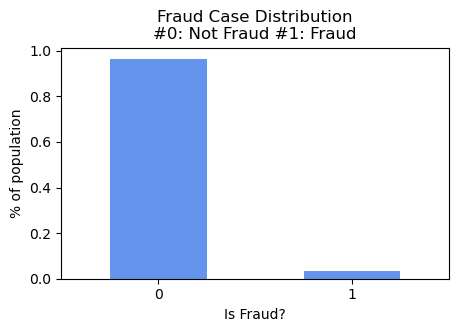
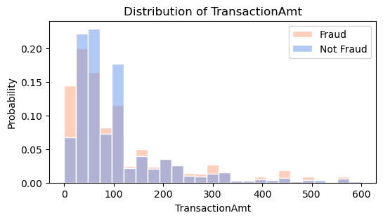

# Payment Transaction Fraud Detection

## Data Source & Genernal Info

Payment Dataset is from [IEEE-CIS Fraud Detection](https://www.kaggle.com/competitions/ieee-fraud-detection/data)
- Train Set: **590,540** transactions with **433** parameters
- Test Set: **506,691** transactions with **433** parameters
- Data Description:
  - TransactionDT: timedelta from a given reference datetime (not an actual timestamp)
  - TransactionAMT: transaction payment amount in USD
  - ProductCD: product code, the product for each transaction
  - card1 - card6: payment card information, such as card type, card category, issue bank, country, etc.
  - addr: address
  - dist: distance
  - P_ and (R__) emaildomain: purchaser and recipient email domain
  - C1-C14: counting, such as how many addresses are found to be associated with the payment card, etc. The actual meaning is masked.
  - D1-D15: timedelta, such as days between previous transaction, etc.
  - M1-M9: match, such as names on card and address, etc.
  - identity information – network connection information (IP, ISP, Proxy, etc) and digital signature (UA/browser/os/version, etc) associated with transactions.

## PART 1 - Data Wrangling & EDA

### Overall Target Variable(IsFraud) & Transaction Amount Distribution

- In the training dataset, there is ~3.5% fraud cases, which is a highly imbalanced datase
- Majority of the payment amount is less than 200, while even higher proportion of fruad transactions are within and around 100

Percentage of Fraudulent Transactions   |  Transaction Amount Distribution across Two Classes
:-------------------------:|:-------------------------:
  |  

### Card Type 

- Majority payments are through **Visa** and **MasterCard**, accounts for **65%** and **32%** respectively, with roughly ~**3.5%** of fraudulent transactions, while **discover** has the highest percentage of fraud cases, which is close to 8%
- Over 74.5% of transactions are paid via **debit card**, while 25.2% are done with **credit card** which contains highest percentage(close to 7%) of fraudulent transactions

### Email Domain

- Top purchaser email domains including gmail (46%), yahoo(20%), hotmail(9%) of the known transactions
- Among the top email domains, 'mail.com' with highest percentage of fraud cases ~20%, while 'outlook.com' contains ~10%

### Counting Information
(such as how many addresses are found to be associated with the payment card)

Since the data for couting information is heavily right skewed, thus looking further into the higher quantile values, and it's interesting to find that for most of the columns, fraud class has much higher values and only columns `C4` & `C9` are opposite.

### Web - Browser Types
- Opera's percentage of fraudulent transactions is the highest among various categories with over 30%, while Chrome is the most popular web browser.

## PART 1 - Analysis & Modeling - TBC
